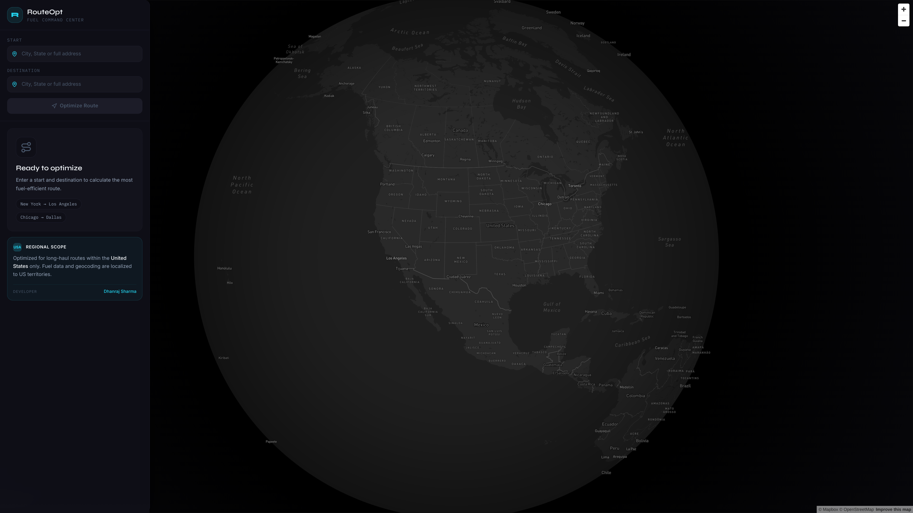
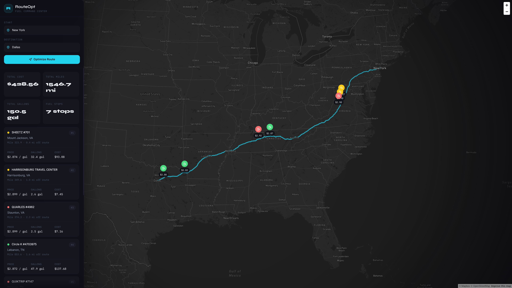
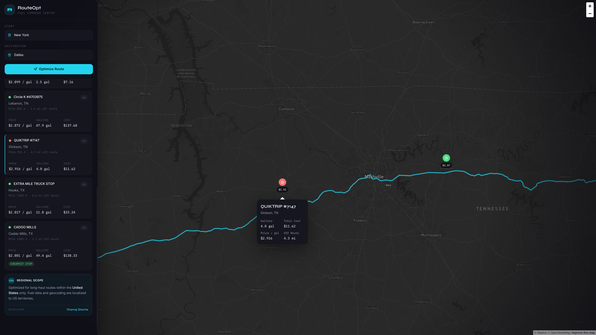

# RouteOpt

Fuel-aware route optimization for long-haul US trucking.

RouteOpt is a full-stack route planning application that helps drivers and fleet operators reduce fuel spend on cross-country trips. Given a start and destination, the system computes a driving route, identifies reachable stations along the path, and selects a cost-efficient fueling strategy based on route distance, station pricing, and vehicle range.

The repository includes:

- a production-quality React + TypeScript frontend with a dark-map command-center interface
- a Django REST API that computes optimized fuel stop plans
- Docker Compose setup for one-command local deployment
- deployment configuration for Render (backend) and Vercel (frontend)

---

## Screenshots

**Home — Ready to Optimize**



**Route Result — New York → Dallas**



**Fuel Stop Detail Popup**



---

## Highlights

- Fuel-optimized trip planning for long-haul US routes
- Interactive full-screen Mapbox experience with route line, custom markers, and stop popups
- Responsive sidebar-to-bottom-sheet layout for desktop and mobile
- Typed frontend and backend contracts
- Reducer-driven request lifecycle and resilient error handling
- Docker Compose setup — spin up both services with a single command
- Render + Vercel deployment setup included in the repo

---

## Product Experience

The frontend is designed as a logistics control surface rather than a demo dashboard.

- Drivers enter a start and destination
- The frontend requests an optimized route from the API
- The backend geocodes the locations, fetches a route from Mapbox, finds nearby candidate stations, and computes the best stop sequence
- The UI renders:
  - total trip fuel cost
  - route mileage and estimated duration
  - total gallons added
  - every planned fuel stop with price, gallons, and stop cost
- Selecting a stop in the list focuses the map and opens its popup
- Selecting a marker on the map scrolls the corresponding stop card into view

---

## Architecture

### Frontend

The frontend is built with:

- React 18
- TypeScript in strict mode
- Vite
- Tailwind CSS v3
- Framer Motion
- Mapbox GL JS via `react-map-gl`
- Lucide React

Key frontend responsibilities:

- collect trip input
- manage request state transitions
- render optimized route summaries
- visualize routes and fuel stops on an interactive map
- keep map movement and UI interactions in sync

### Backend

The backend is a Django + Django REST Framework service that exposes a single core optimization endpoint:

- `POST /route/`

It is responsible for:

- validating incoming route requests
- geocoding start and destination text
- fetching route geometry from Mapbox Directions
- locating nearby stations from the fuel price dataset
- running the fuel optimization algorithm
- returning a structured response to the frontend

### Optimization Flow

```text
Frontend form submit
  -> POST /route/
  -> Validate request
  -> Geocode origin and destination
  -> Fetch route geometry from Mapbox
  -> Find nearby candidate stations
  -> Optimize fuel stops
  -> Return route summary + stop list + polyline coordinates
  -> Render map and sidebar UI
```

---

## Tech Stack

| Layer | Technology |
|---|---|
| Frontend framework | React 18 + Vite |
| Frontend language | TypeScript |
| Styling | Tailwind CSS v3 |
| Animation | Framer Motion |
| Mapping | Mapbox GL JS + react-map-gl |
| Icons | Lucide React |
| Backend | Django 5 + DRF |
| Routing & geocoding | Mapbox APIs |
| Optimization data structures | NumPy + SciPy KDTree |
| Containerization | Docker + Docker Compose |
| Frontend server (Docker) | Nginx (Alpine) |
| Deployment | Vercel + Render |

---

## Repository Structure

```text
.
├── src/                         # React frontend source
├── route_optimizer/             # Django backend
│   ├── config/
│   ├── data/
│   ├── route/
│   │   ├── management/
│   │   └── services/
│   ├── manage.py
│   ├── requirements.txt
│   └── Dockerfile               # Backend container
├── Dockerfile                   # Frontend container (multi-stage Nginx build)
├── docker-compose.yml           # Compose file for local full-stack run
├── nginx.conf                   # Nginx config for the frontend container
├── render.yaml                  # Render Blueprint for the backend
├── vercel.json                  # Vercel project configuration
├── DEPLOYMENT.md                # Platform-specific deployment notes
├── package.json                 # Frontend dependencies and scripts
└── README.md
```

---

## Local Development

### Prerequisites

- Node.js 20+
- npm 10+
- Python 3.11+
- a Mapbox token

### 1. Clone the repository

```bash
git clone https://github.com/NDDimension/fuel-route-optimizer.git
cd fuel-route-optimizer
```

### 2. Configure the frontend

Create a root `.env` file:

```bash
VITE_API_BASE_URL=http://localhost:8000
VITE_MAPBOX_TOKEN=pk.your_mapbox_public_token_here
```

Install frontend dependencies:

```bash
npm install
```

### 3. Configure the backend

Move into the Django app:

```bash
cd route_optimizer
```

Create and activate a virtual environment:

```bash
python -m venv .venv
source .venv/bin/activate
```

Install backend dependencies:

```bash
pip install -r requirements.txt
```

Create `route_optimizer/.env`:

```bash
MAPBOX_TOKEN=pk.your_mapbox_public_token_here
DJANGO_SECRET_KEY=change-me
DJANGO_DEBUG=True
FUEL_CSV_PATH=data/fuel_prices.csv
GEOCODE_CACHE_PATH=geocode_cache.db
MAX_OFF_ROUTE_MILES=5.0
```

### 4. Optional: pre-warm the fuel/geocode cache

Recommended before the first run:

```bash
python manage.py preload_fuel_data
```

### 5. Start the backend

From `route_optimizer/`:

```bash
python manage.py runserver
```

The API will be available at `http://localhost:8000`.

### 6. Start the frontend

From the repository root in a separate terminal:

```bash
npm run dev
```

The app will be available at `http://localhost:5173`.

---

## Docker Setup

Docker Compose runs both the frontend and backend together with a single command. The frontend is built into a static bundle and served by Nginx; the backend runs via Gunicorn.

### Prerequisites

- Docker Desktop (or Docker Engine + Compose plugin)
- a Mapbox token

### 1. Create environment files

**Root `.env`** (for the frontend build arg):

```bash
VITE_MAPBOX_TOKEN=pk.your_mapbox_public_token_here
```

**`route_optimizer/.env`** (for the backend):

```bash
MAPBOX_TOKEN=pk.your_mapbox_public_token_here
DJANGO_SECRET_KEY=change-me-to-a-long-random-string
DJANGO_DEBUG=False
FUEL_CSV_PATH=data/fuel_prices.csv
GEOCODE_CACHE_PATH=geocode_cache.db
MAX_OFF_ROUTE_MILES=5.0
ALLOWED_HOSTS=localhost,127.0.0.1
CORS_ALLOWED_ORIGINS=http://localhost:3000
```

### 2. Build and start

From the repository root:

```bash
docker compose up --build
```

| Service | URL |
|---|---|
| Frontend (Nginx) | http://localhost:3000 |
| Backend (Gunicorn) | http://localhost:8000 |

### 3. Stop

```bash
docker compose down
```

The geocode cache is persisted in a bind mount at `route_optimizer/geocode_cache.db` so it survives container restarts.

### How the containers are structured

**Frontend (`Dockerfile` at repo root)** — multi-stage build:
1. `node:20-slim` builds the Vite app with `VITE_API_BASE_URL` and `VITE_MAPBOX_TOKEN` baked in at build time
2. `nginx:alpine` serves the static output on port 80 (mapped to 3000)

**Backend (`route_optimizer/Dockerfile`)**:
- `python:3.11-slim` with Gunicorn binding on `0.0.0.0:8000`

> **Note:** Because Vite bakes the API URL into the bundle at build time, changing `VITE_API_BASE_URL` requires a rebuild (`docker compose up --build`). For production deployments pointing at a remote backend, update the URL before building.

---

## Frontend Scripts

Run from the repository root:

```bash
npm run dev       # start Vite dev server
npm run build     # production build to dist/
npm run preview   # locally preview the production build
```

---

## API Overview

### `POST /route/`

Request body:

```json
{
  "start": "Chicago, IL",
  "end": "Dallas, TX"
}
```

Successful response:

```json
{
  "start": "Chicago, IL",
  "end": "Dallas, TX",
  "total_miles": 917.3,
  "duration_hours": 13.8,
  "route": [{ "lat": 41.878, "lon": -87.629 }],
  "fuel_stops": [
    {
      "station_id": "4821",
      "name": "PILOT TRAVEL CENTER #220",
      "city": "Springfield",
      "state": "IL",
      "lat": 39.801,
      "lon": -89.643,
      "route_mile": 201.4,
      "off_route_miles": 0.3,
      "gallons_added": 32.1,
      "price_per_gallon": 3.129,
      "stop_cost": 100.44
    }
  ],
  "total_fuel_cost": 284.73,
  "total_gallons": 91.7
}
```

Health endpoint:

```
GET /health/
```

For complete backend details, request/response behavior, and algorithm notes, see [route_optimizer/README.md](./route_optimizer/README.md).

---

## Deployment

### Render + Vercel (current setup)

This repository is configured for:

- **Render** — Django API backend
- **Vercel** — React frontend

Included deployment files:

- [`render.yaml`](./render.yaml)
- [`vercel.json`](./vercel.json)
- [`DEPLOYMENT.md`](./DEPLOYMENT.md)

**Render** uses a Blueprint with Gunicorn, a `/health/` health check, a persistent disk mount for cache data, and environment-driven Django host and CORS configuration.

**Vercel** uses standard Vite build output (`npm install` → `npm run build` → `dist/` as output directory).

### Docker (self-hosted / VPS)

See the [Docker Setup](#docker-setup) section above. For production, set `DJANGO_DEBUG=False`, use a strong `DJANGO_SECRET_KEY`, and configure `ALLOWED_HOSTS` and `CORS_ALLOWED_ORIGINS` to match your domain.

---

## Environment Variables

### Frontend

| Variable | Required | Purpose |
|---|---|---|
| `VITE_API_BASE_URL` | Yes | Base URL for the Django API |
| `VITE_MAPBOX_TOKEN` | Yes | Public Mapbox token for map rendering |

### Backend

| Variable | Required | Purpose |
|---|---|---|
| `MAPBOX_TOKEN` | Yes | Mapbox token for geocoding and routing |
| `DJANGO_SECRET_KEY` | Yes | Django application secret |
| `DJANGO_DEBUG` | Yes | Debug mode toggle |
| `ALLOWED_HOSTS` | Production | Allowed hostnames for Django |
| `CORS_ALLOWED_ORIGINS` | Production | Explicit frontend origins |
| `CORS_ALLOWED_ORIGIN_REGEXES` | Optional | Regex support for preview deployments |
| `FUEL_CSV_PATH` | No | Fuel price CSV path (default: `data/fuel_prices.csv`) |
| `GEOCODE_CACHE_PATH` | No | SQLite cache path (default: `geocode_cache.db`) |
| `MAX_OFF_ROUTE_MILES` | No | Candidate station distance threshold (default: `5.0`) |

---

## Engineering Notes

- The frontend keeps imperative map operations isolated inside a dedicated hook.
- The route API lifecycle is reducer-driven to keep success, loading, idle, and error states explicit.
- Large route geometry is not stored in React state unnecessarily.
- Fuel stop cards and map markers are memoized to avoid unnecessary rerenders.
- The backend performs only one upstream route fetch per request and keeps station lookup and optimization in memory.

---

## Data Source

The repository includes a fuel price dataset used by the backend optimizer to locate and compare candidate stops along a route.

---

## Future Improvements

- authentication and saved trips
- fleet-level route comparison
- cost sensitivity simulations by MPG and tank size
- historical fuel trend overlays
- exportable trip summaries for dispatch teams

---

## License

This repository currently does not declare a license. If you plan to distribute or open-source it broadly, add an explicit license file (MIT is a common choice for open-source projects).
